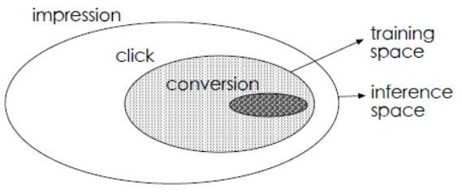
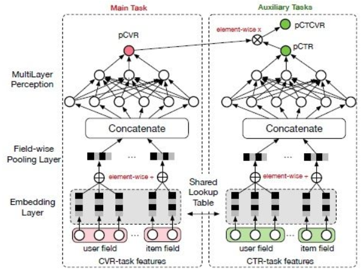

# 【关于 ESMM 】 那些你不知道的事

> 作者：杨夕
> 
> 论文：Entire Space Multi-Task Model : An Effective Approach for Estimating Post-Click Conversion Rate

## 动机

- 目标：准确预估转化率（post-click conversion rate，CVR）重要性【信息检索、推荐系统、在线广告投放系统等工业级的应用】
  - 举例：
    - 在电商平台的推荐系统中，最大化场景商品交易总额（GMV）是平台的重要目标之一，而GMV可以拆解为流量×点击率×转化率×客单价，可见转化率是优化目标的重要因子；从用户体验的角度来说准确预估的转换率被用来平衡用户的点击偏好与购买偏好。
    - user actions follow a sequential pattern of impression(曝光) → click(点击) → conversion(转化、购买)
    - 比如在电商推荐场景下，转化就是购买。排序算法需要对曝光点击率（CTR）和点击转化率（CVR）进行预估，作为排序的依据。
    - $$pCTR=p(点击|曝光)$$
    - $$pCVR=p(转化|曝光, 点击)$$
- 已有方法
  - 方案一
    - 思路：
      - 样本选择：
        - 正样本：把用户点击之后购买的商品作；
        - 负样本：把用户点击之后没有购买的商品；
      - 放入到深度模型里面进行训练
    - 存在问题：
      - 训练样本选择有偏（Sample Selection Bias, SSB）：
        - 用户没有点击的商品没有参与到训练当中，我们预测的时候是对所有的商品进行预测，相当于训练的时候只采样了被点击的商品，导致最终的模型对没有点击的商品表达不足；
      - 数据稀疏（Data Sparsity, DS）：
        - 训练数据少。跟做点击预测的数据相比，训练数据相比非常少，导致更难训练和容易overfit；

  - 方案二  
    - 思路：
      - 样本选择：
        - 正样本：把用户点击之后购买的商品；
        - 负样本：把用户没有点击或者点击之后没有购买的商品；
      - 放入到深度模型里面进行训练
    - 存在问题：
      - CVR 而非 pCVR
        - 训练出来的模型是CVR=p(conversion| impression)，而不是pCVR=p(conversion|click, impression)。它们是有区别的
  - 方案三
    - 思路：
      - 训练一个转化率预估模型；
      - 再训练一个点击预测模型；
      - 再使用转化率预估的结果除以点击预测的结果。
    - 存在问题：
      - 这个方案是可行的，但是这样要训练两个模型，有没有办法放到一个模型里面训练？

## ESMM 模型方法

- 假设：
  - X：feature space;
  - Y：用户是否点击
  - Z：用户是否购买
- 求解问题：
  - $$pCVR=p(z = 1|y = 1, x)$$
- 由条件概率，可得以下公式：
  - 
- pCVR 的计算公式
  - 
- 如图

> 可以看到左侧就是我们要求解的目标pCVR，通过引入右侧的两个辅助任务pCTCVR和pCTR，将我们的目标pCVR转化成深度模型的一个神经元，并共享输入feature的embedding空间。这样，就可以利用到我们点击和不点击的所有训练样本，缓解我们样本偏差和样本稀疏的问题，达到更好的训练效果。

- 损失函数
  - CTR + CTCVR
  - 

## 个人小结

SMM巧妙的通过两个辅助任务对pCVR进行求解，是多任务学习的典范。

