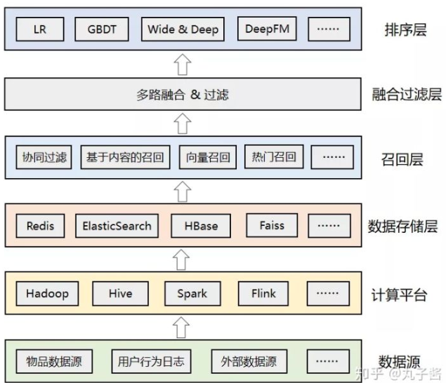

# 【关于 推荐系统】 那些你不知道的事

> 作者：杨夕
> 
> NLP 百面百搭 地址：https://github.com/km1994/NLP-Interview-Notes
> 
> **[手机版NLP百面百搭](https://mp.weixin.qq.com/s?__biz=MzAxMTU5Njg4NQ==&mid=100005719&idx=3&sn=5d8e62993e5ecd4582703684c0d12e44&chksm=1bbff26d2cc87b7bf2504a8a4cafc60919d722b6e9acbcee81a626924d80f53a49301df9bd97&scene=18#wechat_redirect)**
> 
> 推荐系统 百面百搭 地址：https://github.com/km1994/RES-Interview-Notes
> 
> **[手机版推荐系统百面百搭](https://mp.weixin.qq.com/s/b_KBT6rUw09cLGRHV_EUtw)**
> 
> 搜索引擎 百面百搭 地址：https://github.com/km1994/search-engine-Interview-Notes 【编写ing】
> 
> NLP论文学习笔记：https://github.com/km1994/nlp_paper_study
> 
> 推荐系统论文学习笔记：https://github.com/km1994/RS_paper_study
> 
> GCN 论文学习笔记：https://github.com/km1994/GCN_study
> 
> 个人介绍：大佬们好，我叫杨夕，该项目主要是本人在研读顶会论文和复现经典论文过程中，所见、所思、所想、所闻，可能存在一些理解错误，希望大佬们多多指正。

> **所有文章已经搬到 知识星球【关于AiGC那些你不知道的事】，方便大家利用手机学习**

> NLP && 推荐学习群

## 目录

- [【关于 推荐系统】 那些你不知道的事](#关于-推荐系统-那些你不知道的事)
  - [目录](#目录)
  - [什么是推荐系统？](#什么是推荐系统)
  - [推荐系统到底解决的是什么问题？](#推荐系统到底解决的是什么问题)
  - [推荐系统 的 流程是什么？](#推荐系统-的-流程是什么)
  - [推荐系统 的 应用场景？](#推荐系统-的-应用场景)
  - [推荐系统 与 搜索、广告 的 异同？](#推荐系统-与-搜索广告-的-异同)
  - [推荐系统 整体架构？](#推荐系统-整体架构)
  - [推荐系统 核心部分？](#推荐系统-核心部分)
  - [内容介绍](#内容介绍)
    - [推荐系统 基础](#推荐系统-基础)
    - [推荐系统方案](#推荐系统方案)
    - [【关于 推荐系统】 那些你不知道的事](#关于-推荐系统-那些你不知道的事-1)
    - [CTR](#ctr)
    - [CTR](#ctr-1)
    - [Item2Vec](#item2vec)
    - [【关于 Retrieval】那些你不知道的事](#关于-retrieval那些你不知道的事)
  - [外部学习资料整理](#外部学习资料整理)
  - [参考](#参考)

## 什么是推荐系统？

“啤酒与尿布” 的故事相信很多人都听过，年轻爸爸去超市购买尿布时，经常会买点啤酒犒劳自己。因此，沃尔玛将这两种商品进行了捆绑销售，最终获得了更好的销量。

这个故事背后的理论依据就是 “推荐算法”，因为尿布和啤酒经常出现在同一个购物车中，那么向购买尿布的年轻爸爸推荐啤酒确实有一定道理。

## 推荐系统到底解决的是什么问题？

- 问题：信息过载，如何 从 从众多信息中找到用户感兴趣的信息？
- 价值：精准推荐解决了用户痛点，提升了用户体验，最终便能留住用户。

## 推荐系统 的 流程是什么？

- 本质：信息过滤系统；
- 流程：召回->排序->重排序
- 目标：每个环节逐层过滤，最终从海量的物料库中筛选出几十个用户可能感兴趣的物品推荐给用户

## 推荐系统 的 应用场景？

- 场景：
  - 资讯类：今日头条、腾讯新闻等
  - 电商类：淘宝、京东、拼多多、亚马逊等
  - 娱乐类：抖音、快手、爱奇艺等
  - 生活服务类：美团、大众点评、携程等
  - 社交类：微信、陌陌、脉脉等
- 按类别分类：
  - 基于用户维度的推荐：根据用户的历史行为和兴趣进行推荐，比如淘宝首页的猜你喜欢、抖音的首页推荐等；
  - 基于物品维度的推荐：根据用户当前浏览的标的物进行推荐，比如打开京东APP的商品详情页，会推荐和主商品相关的商品给你；

## 推荐系统 与 搜索、广告 的 异同？

- 搜索：有明确的搜索意图，**搜索出来的结果和用户的搜索词相关**；
- 推荐：**不具有目的性，依赖用户的历史行为和画像数据进行个性化推荐**；
- 广告：借助搜索和推荐技术实现广告的精准投放，可以将广告理解成搜索推荐的一种应用场景，技术方案更复杂，涉及到智能预算控制、广告竞价等；

## 推荐系统 整体架构？

- 数据源：推荐算法所依赖的各种数据源，包括物品数据、用户数据、行为日志、其他可利用的业务数据、甚至公司外部的数据。
- 计算平台：负责对底层的各种异构数据进行清洗、加工，离线计算和实时计算。
- 数据存储层：存储计算平台处理后的数据，根据需要可落地到不同的存储系统中，比如Redis中可以存储用户特征和用户画像数据，ES中可以用来索引物品数据，Faiss中可以存储用户或者物品的embedding向量等。
- 召回层：包括各种推荐策略或者算法，比如经典的协同过滤，基于内容的召回，基于向量的召回，用于托底的热门推荐等。为了应对线上高并发的流量，召回结果通常会预计算好，建立好倒排索引后存入缓存中。
- 融合过滤层：触发多路召回，由于召回层的每个召回源都会返回一个候选集，因此这一层需要进行融合和过滤。
- 排序层：利用机器学习或者深度学习模型，以及更丰富的特征进行重排序，筛选出更小、更精准的推荐集合返回给上层业务。

## 推荐系统 核心部分？

- 核心部分
  - 特征：由于数据量大，通常采用大数据的离线和实时处理技术，像Spark、Flink等，然后将计算结果保存在Redis或者其他存储系统中（比如HBase、MongoDB或者ES），供召回和排序模块使用；
  - 算法：
    - 召回算法：从海量数据中快速获取一批候选数据，要求是快和尽可能的准。这一层通常有丰富的策略和算法，用来确保多样性，为了更好的推荐效果，某些算法也会做成近实时的
    - 排序算法：对多路召回的候选集进行精细化排序。它会利用物品、用户以及它们之间的交叉特征，然后通过复杂的机器学习或者深度学习模型进行打分排序，这一层的特点是计算复杂但是结果更精准

## 内容介绍

### [推荐系统 基础](https://github.com/km1994/RS_paper_study/tree/master/base_study)
- [【关于 推荐系统】那些你不知道的事](https://github.com/km1994/RS_paper_study/tree/master/base_study/base1_基础概念篇.md)
- [【关于 召回】那些你不知道的事](https://github.com/km1994/RS_paper_study/tree/master/base_study/base2_召回篇.md)
- [【关于 embedding召回】那些你不知道的事](https://github.com/km1994/RS_paper_study/tree/master/base_study/base3_embedding召回.md)
- [【关于 协同过滤】那些你不知道的事](https://github.com/km1994/RS_paper_study/tree/master/base_study/)
- [【关于 矩阵分解】那些你不知道的事](https://github.com/km1994/RS_paper_study/tree/master/base_study/base5_矩阵分解.md)
- [【关于 FM】那些你不知道的事](https://github.com/km1994/RS_paper_study/tree/master/base_study/base6_FM.md)

### [推荐系统方案](res/)

- [推荐系统方案](res/)
  - [【关于 召回】 那些你不知道的事](res/recall.md)
    - [一、推荐系统 框架图](#一推荐系统-框架图)
    - [二、召回技术演进趋势](#二召回技术演进趋势)
      - [2.1 模型召回介绍](#21-模型召回介绍)
      - [2.2 那么如何在召回阶段利用模型来代替多路召回呢？](#22-那么如何在召回阶段利用模型来代替多路召回呢)
      - [2.3 模型召回的优缺点](#23-模型召回的优缺点)
      - [2.4 模型召回的典型工作](#24-模型召回的典型工作)

### [【关于 推荐系统】 那些你不知道的事](Introduction.md)

- [【关于 推荐系统】 那些你不知道的事](Introduction.md)
  - [一、推荐系统 关系图](#一推荐系统-关系图)
  - [二、大纲](#二大纲)
  - [三、协同过滤算法](#三协同过滤算法)
    - [3.1 思想](#31-思想)
    - [3.2 方法](#32-方法)
      - [3.2.1 基于用户的协同过滤算法(UserCF)](#321-基于用户的协同过滤算法usercf)
      - [3.2.2 基于物品的协同过滤算法(ItemCF)](#322-基于物品的协同过滤算法itemcf)
    - [3.3 存在问题](#33-存在问题)
  - [四、隐语义模型与矩阵分解](#四隐语义模型与矩阵分解)
    - [4.1 动机](#41-动机)
    - [4.2 方法](#42-方法)
      - [4.2.1 隐语义模型](#421-隐语义模型)
      - [4.2.2 矩阵分解算法](#422-矩阵分解算法)
  - [五、FM 模型](#五fm-模型)
    - [5.1 动机](#51-动机)
      - [5.1.1 逻辑回归模型及其缺点](#511-逻辑回归模型及其缺点)
      - [5.1.2 二阶交叉项的考虑及改进](#512-二阶交叉项的考虑及改进)
    - [5.2 FM 模型](#52-fm-模型)
      - [5.2.1 公式](#521-公式)
      - [5.2.2 公式理解](#522-公式理解)
      - [5.2.3 FM 应用](#523-fm-应用)
  - [六、Wide & Deep模型](#六wide--deep模型)
    - [6.1 动机](#61-动机)
    - [6.2 Wide & Deep模型的“记忆能力”与“泛化能力”](#62-wide--deep模型的记忆能力与泛化能力)
      - [6.2.1 类别](#621-类别)
        - [6.2.1.1 Memorization](#6211-memorization)
        - [6.2.1.2 Generalization](#6212-generalization)
      - [6.2.2 介绍](#622-介绍)
    - [6.2.3 结构图](#623-结构图)
      - [6.2.4 如何理解Wide部分有利于增强模型的“记忆能力”，Deep部分有利于增强模型的“泛化能力”？](#624-如何理解wide部分有利于增强模型的记忆能力deep部分有利于增强模型的泛化能力)
        - [6.2.4.1 wide部分](#6241-wide部分)
        - [6.2.4.2 Deep部分](#6242-deep部分)
      - [6.2.5 Wide部分与Deep部分的结合](#625-wide部分与deep部分的结合)
        - [6.2.5.1 W&D模型](#6251-wd模型)
    - [6.3 操作流程](#63-操作流程)
      - [6.3.1 Retrieval](#631-retrieval)
      - [6.3.2 Ranking](#632-ranking)
  - [七、GBDT+LR 模型](#七gbdtlr-模型)
    - [7.1 动机](#71-动机)
    - [7.2 思路](#72-思路)
    - [7.3 优点及适用场景](#73-优点及适用场景)
    - [7.4 LR 模型](#74-lr-模型)
      - [7.4.1 介绍](#741-介绍)
      - [7.4.2 vs 协同过滤和矩阵分解](#742-vs-协同过滤和矩阵分解)
      - [7.4.3 流程](#743-流程)
      - [7.4.4 计算流程](#744-计算流程)
      - [7.4.5 目标函数](#745-目标函数)
      - [7.4.6 优点](#746-优点)
      - [7.4.7 缺点](#747-缺点)
    - [7.5 梯度提升决策树（GBDT）模型](#75-梯度提升决策树gbdt模型)
      - [7.5.1 介绍](#751-介绍)
      - [7.5.2 解决二分类和回归问题的方式](#752-解决二分类和回归问题的方式)
      - [7.5.3 损失函数](#753-损失函数)
      - [7.5.4 构建分类GBDT的步骤](#754-构建分类gbdt的步骤)
      - [7.5.5 优缺点](#755-优缺点)
    - [7.6 GBDT+LR 模型](#76-gbdtlr-模型)
      - [7.6.1 思路](#761-思路)
      - [7.6.2 步骤](#762-步骤)
      - [7.6.3 关键点](#763-关键点)
  - [参考](#参考)

### [CTR](CTR/)

- [CTR](CTR/)
  - [【关于 GBDT+LR】 那些你不知道的事](CTR/GBDT_LR/)
  - [【关于 DeepCF】那些你不知道的事](CTR/DeepCF_study/)
  - [【关于 DeepFM 】那些你不知道的事](CTR/DeepFM_study/)
  - [【关于 DIEN】 那些你不知道的事](CTR/DIEN/)
  - [【关于 ESMM 】 那些你不知道的事](CTR/DIN/)
  - [【关于 FiBiNET】那些你不知道的事](CTR/DIN/)
    - 论文：FiBiNET: Combining Feature Importance and Bilinear feature Interaction for Click-Through Rate Prediction（结合特征重要性和双线性特征相互作用进行点击率预测）
  - [【关于 阿里深度兴趣网络（DIN）】 那些你不知道的事](CTR/FiBiNet_study/)
    - 任务：点击率预测
    - 前沿方法介绍：基于深度学习的模型，该模型遵循类似的嵌入ding和MLP范式。
      - 思路：
        - 首先将大规模稀疏输入特征映射为低维嵌入向量；
        - 然后分组变换为定长向量；
        - 最后拼接成多层感知器（MLP），学习特征之间的非线性关系。
      - 优点：通过这种方式，用户特征被压缩成一个固定长度的表示向量，而不管候选广告是什么。
      - 缺点：固定长度向量的使用将成为一个瓶颈，这给嵌入和MLP方法从丰富的历史行为中有效地捕获用户的不同兴趣带来了困难。

    - 论文方法：深度兴趣网络（Deep Interest Network，DIN）
      - 思路：通过设计一个局部激活单元，自适应地学习用户兴趣的表示，从历史行为到某个特定的广告，这种表示向量在不同的状态下变化，大大提高了模型的表达能力。
      - 开发了两种技术：小批量感知正则化和数据自适应激活函数，可以帮助训练具有数亿参数的工业深度网络。
      - 实验结果：在两个公共数据集和一个超过20亿样本的阿里巴巴真实生产数据集上的实验表明了所提方法的有效性，其性能优于现有的方法。目前，DIN已成功部署在阿里巴巴的在线展示广告系统中，服务于主要业务。

### [CTR](CTR/)

- [DeepWalk](DeepWalk/)
  - [【关于 DeepWalk】 那些你不知道的事](DeepWalk/)

### [Item2Vec](Item2Vec/)

- [Item2Vec](Item2Vec/)
  - [【关于 Item2Vec 】 那些你不知道的事](Item2Vec/)

### [【关于 Retrieval】那些你不知道的事](Retrieval/)

- [【关于 Embedding-based Retrieval in Facebook Search】那些你不知道的事](Retrieval/EmbeddingbasedRetrievalinFacebookSearch/)
  - [一、引言](#一引言)
  - [二、搜索引擎类别介绍](#二搜索引擎类别介绍)
    - [2.1 term matching（文本匹配）](#21-term-matching文本匹配)
    - [2.2 semantic matching（语义匹配）](#22-semantic-matching语义匹配)
  - [三、搜索引擎方法](#三搜索引擎方法)
    - [3.1 搜索引擎方法介绍](#31-搜索引擎方法介绍)
    - [3.2 检索](#32-检索)
    - [3.3 排序](#33-排序)
  - [四、摘要](#四摘要)
  - [五、 在 Facebook 搜索中应用 Embedding-based Retrieval 技术遇到的挑战](#五-在-facebook-搜索中应用-embedding-based-retrieval-技术遇到的挑战)
  - [六、本文搜索引擎建模](#六本文搜索引擎建模)
    - [6.1 问题定位](#61-问题定位)
    - [6.2 Unified Embedding Model](#62-unified-embedding-model)
    - [6.3 损失函数](#63-损失函数)
    - [6.4 正负样本选取策略](#64-正负样本选取策略)
  - [七、特征工程](#七特征工程)
  - [八、在线Serving](#八在线serving)
    - [8.1 线上近似最近邻搜索](#81-线上近似最近邻搜索)
    - [8.2 基于 term 的布尔表达式](#82-基于-term-的布尔表达式)
    - [8.2 优化方案](#82-优化方案)
  - [九、Full-stack优化](#九full-stack优化)
    - [9.1 基于 embedding 召回的结果自然是被次优处理的 问题](#91-基于-embedding-召回的结果自然是被次优处理的-问题)
    - [9.2 基于 embedding 的语义召回模型需要更加深入的分析才能不断提升性能 问题](#92-基于-embedding-的语义召回模型需要更加深入的分析才能不断提升性能-问题)

## 外部学习资料整理

- [推荐算法在招聘商业化场景中的应用实践](https://mp.weixin.qq.com/s/RFDooFafs5fKKNd2Rrf04A)
  - 内容：
  - 1、58APP端招聘商业化推荐场景；
  - 2、58招聘商业推荐系统的目标；
  - 3、58平台上求职者特性；
  - 4、58招聘商业场景特点；
  - 5、58商业推荐系统架构；
  - 6、总结与展望。

## 参考
