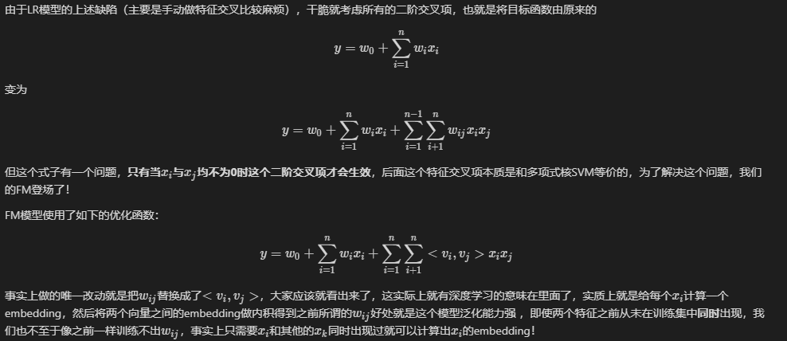

# 【关于 FM】那些你不知道的事

> 笔者：杨夕
>
> 项目地址：https://github.com/km1994/nlp_paper_study
> 
> 个人介绍：大佬们好，我叫杨夕，该项目主要是本人在研读顶会论文和复现经典论文过程中，所见、所思、所想、所闻，可能存在一些理解错误，希望大佬们多多指正。

## 整体框架图

## 逻辑回归LR

### 介绍

- 思路：一般来说做推荐CTR预估时最简单的思路就是将特征做线性组合（逻辑回归LR），传入sigmoid中得到一个概率值；
- 本质：这就是一个线性模型，因为sigmoid是单调增函数不会改变里面的线性模型的CTR预测顺序，因此逻辑回归模型效果会比较差。

### 缺点

- 是一个线性模型
- 每个特征对最终输出结果独立，需要手动特征交叉（$x_i*x_j$），比较麻烦;

 ## 二阶交叉项的考虑及改进
 
 
 
 ## FM
 
 ### 公式介绍
 
 - 公式介绍：
    - 模型前半部分就是普通的LR线性组合；
    - 后半部分的交叉项：特征组合

首先，单从模型表达能力上来看，FM是要强于LR的，至少它不会比LR弱，当交叉项参数$w_{ij}$全为0的时候，整个模型就退化为普通的LR模型。对于有$n$个特征的模型，特征组合的参数数量共有$1+2+3+\cdots  + n-1=\frac{n(n-1)}{2}$个，并且任意两个参数之间是独立的。所以说特征数量比较多的时候，特征组合之后，维度自然而然就高了。

> 定理：任意一个实对称矩阵（正定矩阵）$W$都存在一个矩阵$V$，使得 $W=V.V^{T}$成立。

类似地，所有二次项参数$\omega_{ij}$可以组成一个对称阵$W$（为了方便说明FM的由来，对角元素可以设置为正实数），那么这个矩阵就可以分解为$W=V^TV$，$V$ 的第$j$列($v_{j}$)便是第$j$维特征($x_{j}$)的隐向量。

$$
\hat{y}(X) = \omega_{0}+\sum_{i=1}^{n}{\omega_{i}x_{i}}+\sum_{i=1}^{n-1}{\sum_{j=i+1}^{n} \color{red}{<v_{i},v_{j}>x_{i}x_{j}}}
$$

需要估计的参数有$\omega_{0}∈ R$，$\omega_{i}∈ R$，$V∈ R$，$< \cdot, \cdot>$是长度为$k$的两个向量的点乘，公式如下：

$$
<v_{i},v_{j}> = \sum_{f=1}^{k}{v_{i,f}\cdot v_{j,f}}
$$

- 上面的公式中： 
    - $\omega_{0}$为全局偏置；
    - $\omega_{i}$是模型第$i$个变量的权重;
    - $\omega_{ij} = < v_{i}, v_{j}>$特征$i$和$j$的交叉权重;
    - $v_{i} $是第$i$维特征的隐向量;
    - $<\cdot, \cdot>$代表向量点积;
    - $k(k<<n)$为隐向量的长度，包含 $k$ 个描述特征的因子。

FM模型中二次项的参数数量减少为 $kn$个，远少于多项式模型的参数数量。另外，参数因子化使得 $x_{h}x_{i}$ 的参数和 $x_{i}x_{j}$ 的参数不再是相互独立的，因此我们可以在样本稀疏的情况下相对合理地估计FM的二次项参数。具体来说，$x_{h}x_{i}$ 和 $x_{i}x_{j}$的系数分别为 $\lt v_{h},v_{i}\gt$ 和 $\lt v_{i},v_{j}\gt$ ，它们之间有共同项 $v_{i}$ 。也就是说，所有包含“ $x_{i}$ 的非零组合特征”（存在某个 $j \ne i$ ，使得 $x_{i}x_{j}\neq 0$ ）的样本都可以用来学习隐向量$v_{i}$，这很大程度上避免了数据稀疏性造成的影响。而在多项式模型中,$w_{hi}$ 和 $w_{ij}$ 是相互独立的。

显而易见，FM的公式是一个通用的拟合方程，可以采用不同的损失函数用于解决regression、classification等问题，比如可以采用MSE（Mean Square Error）loss function来求解回归问题，也可以采用Hinge/Cross-Entropy loss来求解分类问题。当然，在进行二元分类时，FM的输出需要使用sigmoid函数进行变换，该原理与LR是一样的。直观上看，FM的复杂度是 $O(kn^2)$ 。但是FM的二次项可以化简，其复杂度可以优化到 $O(kn)$ 。由此可见，FM可以在线性时间对新样本作出预测。

### FM模型的应用

最直接的想法就是直接把FM得到的结果放进sigmoid中输出一个概率值，由此做CTR预估，事实上我们也可以做召回。

由于FM模型是利用两个特征的Embedding做内积得到二阶特征交叉的权重，那么我们可以将训练好的FM特征取出离线存好，之后用来做KNN向量检索。

工业应用的具体操作步骤：

* 离线训练好FM模型（学习目标可以是CTR）
* 将训练好的FM模型Embedding取出
* 将每个uid对应的Embedding做avg pooling（平均）形成该用户最终的Embedding，item也做同样的操作
* 将所有的Embedding向量放入Faiss等
* 线上uid发出请求，取出对应的user embedding，进行检索召回
