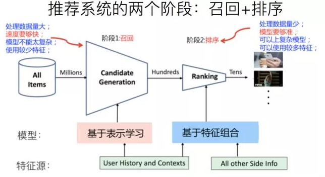
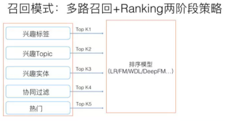
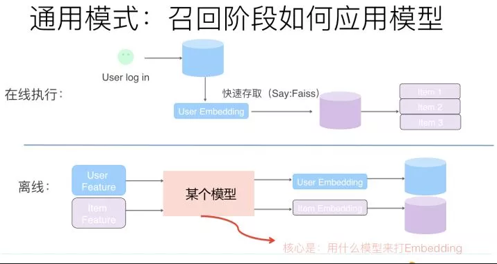
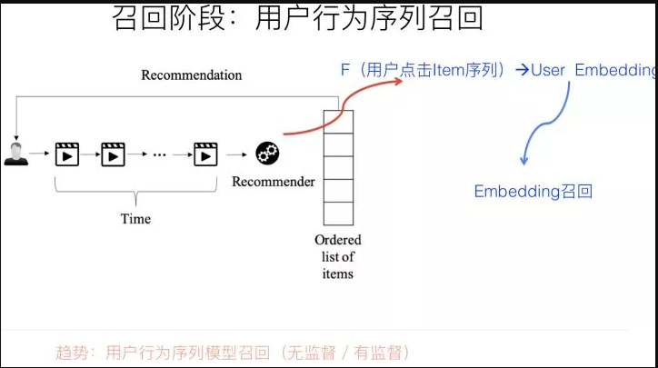
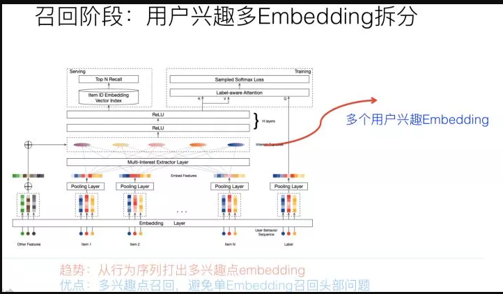

# 【关于 召回】 那些你不知道的事

> 作者：杨夕
> 
> 项目地址：https://github.com/km1994/RS_paper_study
> 
> 个人介绍：大佬们好，我叫杨夕，该项目主要是本人在研读顶会论文和复现经典论文过程中，所见、所思、所想、所闻，可能存在一些理解错误，希望大佬们多多指正。

- [【关于 召回】 那些你不知道的事](#关于-召回-那些你不知道的事)
  - [一、推荐系统 框架图](#一推荐系统-框架图)
  - [二、模型召回](#二模型召回)
    - [2.1 模型召回介绍](#21-模型召回介绍)
    - [2.2 那么如何在召回阶段利用模型来代替多路召回呢？](#22-那么如何在召回阶段利用模型来代替多路召回呢)
    - [2.3 模型召回的优缺点](#23-模型召回的优缺点)
    - [2.4 模型召回的典型工作](#24-模型召回的典型工作)
  - [三、用户行为序列召回](#三用户行为序列召回)
    - [3.1 引言](#31-引言)
    - [3.2 用户行为序列召回介绍](#32-用户行为序列召回介绍)
    - [3.3 物品聚合函数 Fun 如何定义？](#33-物品聚合函数-fun-如何定义)
    - [3.4 如何根据用户行为序列 做 emb?](#34-如何根据用户行为序列-做-emb)
    - [3.5 典型工作](#35-典型工作)
  - [四、用户多兴趣拆分](#四用户多兴趣拆分)
    - [4.1 动机](#41-动机)
  - [参考](#参考)

## 一、推荐系统 框架图

在推荐系统中从粗粒度角度看，可以分类两个阶段：

1. 召回：根据用户部分特征，从海量的物品库里，快速找回一小部分用户潜在感兴趣的物品，一般强调【快】；
2. 排序：排序环节可以融入较多特征，使用复杂模型，来精准地做个性化推荐，一般强调【准】；

在推荐系统中从细粒度角度看，可以分类两个阶段：
1. 召回
2. 粗排：有时候因为每个用户召回环节返回的物品数量还是太多，怕排序环节速度跟不上，所以可以在召回和精排之间加入一个粗排环节，通过少量用户和物品特征，简单模型，来对召回的结果进行个粗略的排序，在保证一定精准的前提下，进一步减少往后传送的物品数量，粗排往往是可选的，可用可不同，跟场景有关；
3. 精排：使用你能想到的任何特征，可以上你能承受速度极限的复杂模型，尽量精准地对物品进行个性化排序；
4. 重排

## 二、模型召回

### 2.1 模型召回介绍

传统的召回方法只要 采用 多路召回的方式

根据召回路是否有用户个性化因素存在来划分，可以分成两大类：

1. 无个性化因素的召回路，比如热门商品或者热门文章或者历史点击率高的物料的召回；
2. 个性化因素的召回路，比如用户兴趣标签召回。该召回可以视为 单特征模型排序的排序结果，也就是可以把某路召回，看成是某个排序模型的排序结果，只不过，这个排序模型，在用户侧和物品侧只用了一个特征。

> eg： 
> 标签召回，其实就是用用户兴趣标签和物品标签进行排序的单特征排序结果；  
> 协同召回，可以看成是只包含UID和ItemID的两个特征的排序结果…. 

如果我们换做上面的角度看待有个性化因素召回路，那么在召回阶段引入模型，就是自然而然的一个拓展结果：无非是把单特征排序，拓展成多特征排序的模型而已；而多路召回，则可以通过引入多特征，被融入到独立的召回模型中，找到它的替代品。如此而已。所以，随着技术的发展，在embedding基础上的模型化召回，必然是个符合技术发展潮流的方向。

### 2.2 那么如何在召回阶段利用模型来代替多路召回呢？

> 抽象的模型召回的通用架构

- 核心思想：**将用户特征和物品特征分离，各自通过某个具体的模型，分别打出用户Embedding以及物品Embedding。**

> 注：在线上，可以根据用户兴趣Embedding，采用类似Faiss等高效Embedding检索工具，快速找出和用户兴趣匹配的物品，这样就等于做出了利用多特征融合的召回模型了。理论上来说，任何你能见到的有监督模型，都可以用来做这个召回模型，比如FM／FFM／DNN等，常说的所谓“双塔”模型，指的其实是用户侧和物品侧特征分离分别打Embedding的结构而已，并非具体的模型。

### 2.3 模型召回的优缺点

- 优点：
  - 多路召回每路截断条数的超参个性化问题等会自然被消解掉
- 缺点：
  - 比较典型的是召回内容头部问题，因为之前多路，每路召回个数靠硬性截断，可以根据需要，保证你想要召回的，总能通过某一路拉回来；而由于换成了模型召回，面向海量物料库，排在前列得分高的可能聚集在几个物料分布比较多的头部领域
- 解决方法：训练数据对头部领域的降采样，减少某些领域主导，以及在模型角度鼓励多样性等不同的方法

> 注：如果在召回阶段使用模型召回，理论上也应该同步采用和排序模型相同的优化目标，尤其是如果排序阶段采用多目标优化的情况下，召回模型也应该对应采取相同的多目标优化。同理，如果整个流程中包含粗排模块，粗排也应该采用和精排相同的多目标优化，几个环节优化目标应保持一致。因为召回和粗排是精排的前置环节，否则，如果优化目标不一致，很可能会出现高质量精排目标，在前置环节就被过滤掉的可能，影响整体效果。

### 2.4 模型召回的典型工作

- FM模型召回：推荐系统召回四模型之：全能的FM模型
- DNN双塔召回：Sampling-Bias-Corrected Neural Modeling for Large Corpus Item Recommendations

## 三、用户行为序列召回

### 3.1 引言

用户在使用APP或者网站的时候，一般会产生一些针对物品的行为，比如点击一些感兴趣的物品，收藏或者互动行为，或者是购买商品等。而一般用户之所以会对物品发生行为，往往意味着这些物品是符合用户兴趣的，而不同类型的行为，可能代表了不同程度的兴趣。比如购买就是比点击更能表征用户兴趣的行为。

而用户行为过的物品序列，其实是具备表征用户兴趣的非常有价值的信息，而且这种兴趣表征，是细粒度的用户兴趣，所以对于刻画用户兴趣具备特别的价值。利用用户行为过的物品序列，来表征用户兴趣，具备很好的实用价值。

那么问题来了，我们是否可以利用用户行为过的物品序列对用户兴趣建模呢？

### 3.2 用户行为序列召回介绍

- 输入：用户行为过的物品序列，可以只用物品ID表征，也可以融入物品的Side Information比如名称，描述，图片等；
- 函数 Fun：利用一个函数Fun将这些物品为输入，然后通过一定的方法把这些进行糅合到一个embedding里，而这个糅合好的embedding，就代表了用户兴趣；
- 使用：无论是在召回过程，还是排序过程，都可以融入用户行为序列。

**在召回阶段，我们可以用用户兴趣Embedding采取向量召回，而在排序阶段，这个embedding则可以作为用户侧的特征。**

### 3.3 物品聚合函数 Fun 如何定义？

- 关键点：用户行为序列中的物品，是**有时间顺序**的。理论上，任何能够体现时序特点或特征局部性关联的模型，都比较适合应用在这里；
- 常用模型：CNN、RNN【GRU 效果最优】、Transformer 等

### 3.4 如何根据用户行为序列 做 emb?

- 模型：
  - 有监督方法：Next Item Prediction的预测方式；
  - 无监督方法：比如物品只要能打出embedding，就能无监督集成用户行为序列内容，例如Sum Pooling

### 3.5 典型工作

- GRU：Recurrent Neural Networks with Top-k Gains for Session-based Recommendations
- CNN：Personalized Top-N Sequential Recommendation via Convolutional Sequence Embedding
- Transformer: Self-Attentive Sequential Recommendation

## 四、用户多兴趣拆分

### 4.1 动机

上文讲了利用用户行为物品序列，打出用户兴趣Embedding的做法。但是，另外一个现实是：**用户往往是多兴趣的**，比如可能同时对娱乐、体育、收藏感兴趣。这些不同的兴趣也能从用户行为序列的物品构成上看出来，比如行为序列中大部分是娱乐类，一部分体育类，少部分收藏类等。那么能否把用户行为序列物品中，这种不同类型的用户兴趣细分，而不是都笼统地打到一个用户兴趣Embedding里呢？用户多兴趣拆分就是解决这类更细致刻画用户兴趣的方向。

## 参考

1. [推荐系统技术演进趋势：召回篇](https://mp.weixin.qq.com/s/XT0RNJoi3pUgm4K_xvNhcQ)
